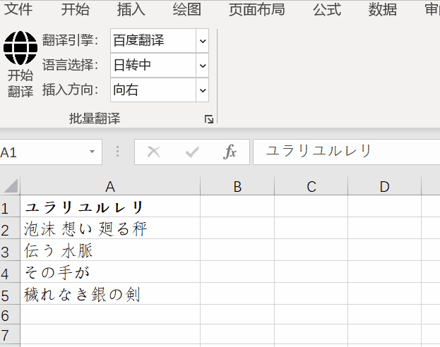

# BatchTranslatorAddIn
## 项目介绍
这是一个用于单元格批量翻译Excel VSTO加载项。目前支持调用百度翻译和彩云翻译的API。
使用流程如下：
1. 打开设置面板，设置翻译引擎的使用密钥，并保存。
2. 在菜单栏中选择要翻译的语言、翻译引擎、翻译结果插入方向。
3. 选中单元格Excel单元格。
4. 点击开始翻译，弹出翻译任务实时进度面板。
5. 翻译完成，手动关闭面板，此时翻译结果单元格已经自动插入。

